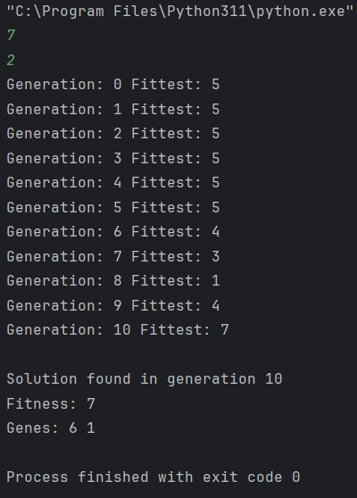
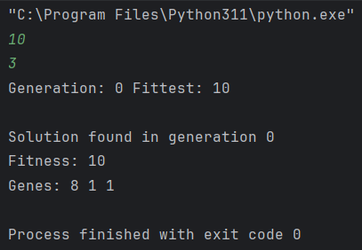

<h1>LabPerformance14-DCLP3</h1>  
<h2>Given a target integer T and a fixed list length k, evolve a list of k numbers (0–9) whose sum equals T.</h2>
   
<h2>Output</h2>
<h3>Case#1</h3>

<h3>Case#2</h3>

