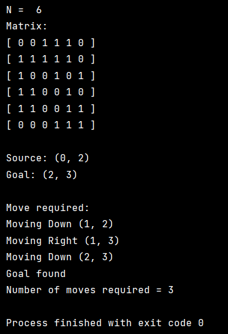

<h1>LabReport01-GraphTraversal</h1>  
<h2>Depth-First Search (DFS) Implementation</h2>
    
<h2>Introduction</h2>

In This lab we can see the demonstration of implementation of the Depth-First Search (DFS) algorithm for grid-based pathfinding. The algorithm successfully explores possible paths from a source node to a goal node using recursive traversal. Using a Cartesian grid and movement constraints provided practical insights into graph traversal techniques. Proper handling of visited nodes ensures efficient search, while depth tracking determines the number of moves required.

    
<h2>Output</h2>

