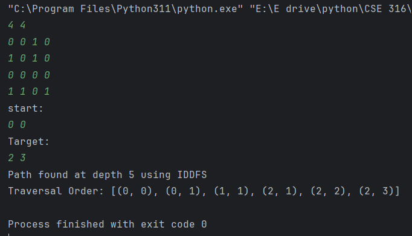
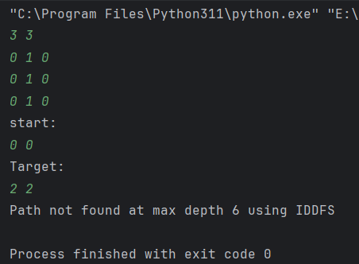

<h1>LabReport02-IDDFS</h1>  
<h2>Iterative Deepening Depth-First Search(IDDFS) Implementation</h2>
    
<h2>Introduction</h2>

This task implements Iterative Deepening DFS (IDDFS) to solve maze pathfinding on a 2D grid (0=path, 1=wall), checking for valid start-to-target routes via adjacent moves without revisits. The solution outputs either the found path with depth (e.g., "Path found at depth 5") or a failure message (e.g., "Path not found at max depth 6"), demonstrating optimal traversal for both solvable and unsolvable mazes.

    
<h2>Output</h2>

