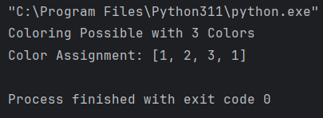

<h1>LabReport03-GraphColoring</h1>  
<h2>Graph Color Algorithm Implementation</h2>
    
<h2>Introduction</h2>

The task involves implementing a backtracking algorithm in Python to solve the graph K-coloring problem, where the goal is to determine if a given undirected graph can be colored using at most K colors such that no adjacent vertices share the same color. The input consists of a graph's vertices and edges read from a file, and the output indicates whether a valid coloring exists along with the color assignments if successful.

    
<h2>Output</h2>
<h3>Case#1</h3>

<h3>Case#2<h3>

