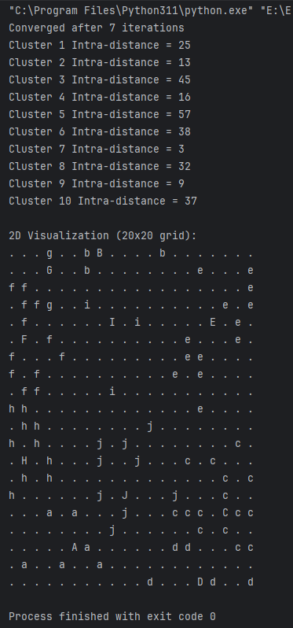

<h1>LabReport04-kMeansClustering</h1>  
<h2>Implementing K-Means Clustering Algorithm</h2>
    
<h2>Introduction</h2>

This lab task involves implementing  a modified K-Means clustering algorithm in Python that uses the Manhattan distance. The program will generate 100 random Cartesian data points and 10 initial cluster centers, each defined by (x, y) coordinates. The algorithm assigns each point to the closest cluster center based on Manhattan distance and updates the cluster centers in a loop. Finally, a 2D matrix is printed to show the final clusters, using different symbols for data points and cluster centers.

    
<h2>Output</h2>

