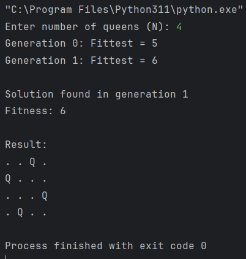

<h1>LabReport05-GeneticAlgorithms</h1>  
<h2>Solving the N-Queens problem using Genetic Algorithms.</h2>
    
<h2>Introduction</h2>

The N-Queens problem is a classic constraint satisfaction challenge that requires placing N queens on an N×N chessboard without mutual threats. This lab implements a Genetic Algorithm to solve the problem by evolving solutions through selection, crossover, and mutation. The Genetic Algorithm  approach efficiently explores possible configurations while optimizing for non-attacking queen placements.

    
<h2>Output</h2>

