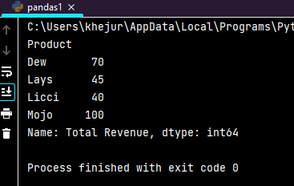

<h1>Python Tools</h1>

This repository contains a collection of Python Tools showcasing various tasks related to data structures, NumPy, Pandas, and Matplotlib.

<h2>List: Remove Duplicates and Sort</h2>

Given a list of numbers, remove duplicates and sort the list in ascending order.

Output Screenshot:

<h2>Set: Find Common Elements</h2>

Find the common elements between two lists using sets.

Output Screenshot:

<h2>Tuple: Sort Student Records by Grade</h2>

Create a tuple of student records (name, age, grade) and sort the records by grade.

Output Screenshot:

<h2>Dictionary: Count Word Occurrences</h2>

Count word occurrences in a given text and store them in a dictionary.

Output Screenshot:

<h2>NumPy#1: Generate 5x5 Matrix and Compute Row-Wise Sums</h2>

Generate a 5x5 matrix of random integers and compute the row-wise sums.

Output Screenshot:

<h2>NumPy#2: Create an Array of Random Values and Normalize</h2>

Create an array of 100 random values and normalize them between 0 and 1.

Output Screenshot:

<h2>Pandas#1: Load CSV and Compute Total Revenue per Product</h2>

Load a CSV file of sales data and compute the total revenue per product.

Output Screenshot:

<h2>Pandas#2: Fill Missing Values with Column-Wise Means</h2>

Fill missing values in a dataset with column-wise means.

Output Screenshot:

<h2>Matplotlib#1: Plot a Line Graph of Temperature Variations</h2>

Plot a line graph showing temperature variations over a week.

Output Screenshot:

<h2>Matplotlib#2: Create a Bar Chart Comparing Sales Revenue</h2>

Create a bar chart comparing sales revenue across different regions.

Output Screenshot:

